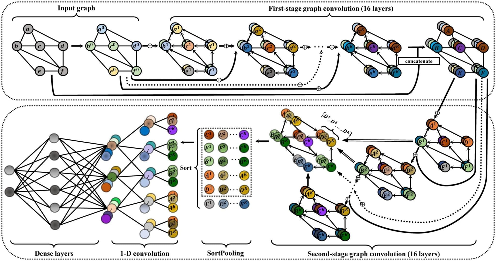

# **Graph Neural Networks for Drug Discovery**

This project focuses on using Graph Neural Networks (GNNs) for molecular analysis in drug discovery. By representing molecules as graphs, GNNs can capture complex relationships within chemical compounds, enabling accurate predictions of properties and interactions essential for drug development.

## **What You’ll Learn**
- Understand how GNNS, GCNs work and their applications in drug discovery and learn to process molecular data as graphs for property prediction.
- Gain hands-on experience with tools like PyTorch Geometric, RDKit, and ChEMBL.
- Graphical Neural Networks will be really great from Resume point of view as well since it is used heavily in real world projects.

---

## **Tentative Project Plan**

### **Week 1: Basics of ML and Neural Networks**
**Focus**: Learn Python basics, libraries like Numpy, pyplot, and foundational machine learning concepts.  
**Key Topics**:  
- Python syntax, data types, functions, and OOP basics.  
- Using Numpy for arrays and matrix operations.  
- Plotting graphs with Matplotlib for analysis.  
- Understanding Linear and Logistic Regression(to get the basic gist of supervised learning).  
- Understanding Basics of Neural Networks.  

**Assignments**:  
- Implement Linear and Logistic Regression using Numpy.  
- Implement K-Means clustering to understand Numpy operations.
- (Optional) Implement Feed Forward Neural Network from scratch using numpy

---

### **Weeks 2, 3: Deep Dive into GNNs and GCNs**
**Focus**: Learn advanced concepts like Convolutional Neural Networks (CNNs), Graph Neural Networks (GNNs), and Graph Convolutional Networks (GCNs).  
**Key Topics**:  
- Essentials of graph theory and data structure: structures, properties, and algorithms.  
- Essential Linear Algebra Concepts. 
- Understanding the CNN, GNN and GCNs architectures. 

**Assignments**:  
- Some relevant Assigments in Pytorch and Pytorch Geometric
- Some relevant articles and papers for better understanding

>*These weeks contains heavy content to grasp so in order to have smooth learning experience, we will be giving you daily targets for each day in these 2 weeks to cover and following it would be highly recommended.*
---

### **Weeks 4, 5: Final Project Implementation**
**Focus**: Use GNNs to analyze molecular data and predict properties relevant to drug development.  
**Key Topics**:  
- Learn to handle molecular data and preprocessing using RDKit and ChEMBL.  
- Understand theoritical point of view of molecular properties and represent them as graphs.  
- Train and fine-tune GNNs for various Drug Properties prediction.  

**Assignments**:  
- Implement the Project
- If Time permits, we will implement a research paper on some standard GCN architecture in drug discovery.
---

**Submission of Assigments**: Make your github repository, we will also float the official GitHub repo for WiDs in a few days. You can clone our repo and add your work to it. We will float Google forms asking the repo links, please feel free to reach out in case you are new to GitHub.

> **This Project will demand mentees to grasp heavy content with various non trivial concepts so remaining consistent on the projects with regularly and sincerely attempting and completing assignments will be expected and it will make the learnings smooth for this project. If you ever feel that the project is being slow or fast, you can definitely reach out to us in order to solve the issue. If you do not understand any concept or remain stuck at it, you can always google them or use chat gpt to understand them (most of the times this will work) and you can always definitely reach out to us to clear any doubts.**

Let’s get started!

### Week 2: Understanding Advanced Neural Networks and Graph Neural Networks
- **Resources**: 
  - To get the intuition of ReLU activation, read this article: [Visualizing Piecewise Linear Neural Networks](https://blog.janestreet.com/visualizing-piecewise-linear-neural-networks/).
  - Go over this [Coursera course](https://www.coursera.org/learn/neural-networks-deep-learning) to learn more about neural networks.

#### For Graph Neural Networks
- **Articles for Basic Ideas**:
  - [Neptune.ai: Graph Neural Network and Some of GNN Applications](https://neptune.ai/blog/graph-neural-network-and-some-of-gnn-applications)
  - [Distill.pub: Understanding GNNs](https://distill.pub/2021/understanding-gnns/)
  - [Towards Data Science: Graph Convolutional Networks](https://towardsdatascience.com/graph-convolutional-networks-introduction-to-gnns-24b3f60d6c95)

- **Optional Readings**:
  - Read and understand the research paper: [Neural Message Passing for Quantum Chemistry](https://arxiv.org/pdf/1704.01212).
  - Read this article on how to use Graphical Neural Networks in drug discovery: [Drug Discovery and Graph Neural Networks](https://medium.com/@mulugetas/drug-discovery-and-graph-neural-networks-gnns-a-regression-example-fc738e0f11f3).

#### Tutorials and Videos
- [YouTube: Graph Neural Networks Introduction](https://www.youtube.com/watch?v=8owQBFAHw7E)
- [YouTube Playlist: Graph Neural Networks](https://youtube.com/playlist?list=PLoROMvodv4rPLKxIpqhjhPgdQy7imNkDn&si=GiLMZdfS5szrhH0z)
